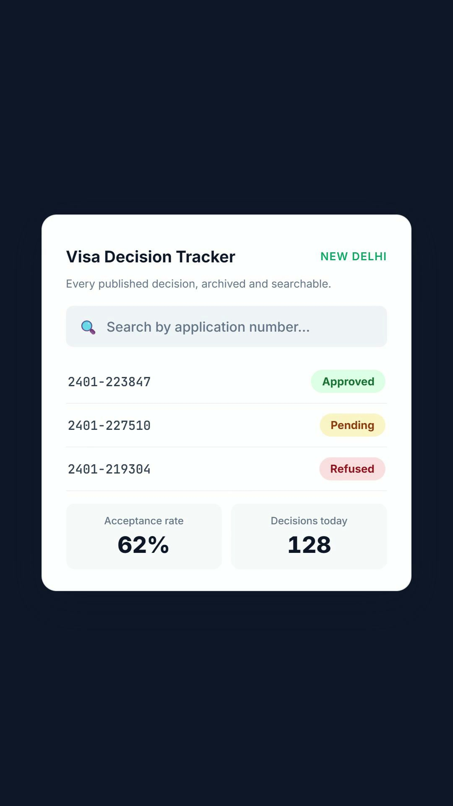

# Irish Visa Decision Tracker

A personal tool that keeps an eye on the daily visa-decision list published by the **Embassy of Ireland in New Delhi**, and turns it into a clean, searchable dashboard.

## Watch it

A 30-second trailer — click the poster to play:

[](brag-output/brag.mp4)

## Why it exists

Every business day the embassy posts a spreadsheet of visa decisions. It's a single flat file — **no history, no search, no trends**. If you were applying, checking your decision meant opening that day's file and hunting.

This project saves a running record automatically, so you can:

- See the **latest decisions** on the day they're published
- **Look up any application number** and see its outcome
- Browse **daily summaries** of how many were accepted vs rejected
- Watch **trends over time** — acceptance and rejection rates, busiest days

## How it works (in plain English)

- A small automated **scraper** checks the embassy's site several times each morning and saves anything new.
- It's smart about **weekends and public holidays** — if the office is closed, it simply notes that and moves on.
- The results are kept in **JSON files in this repo** (`data/visa_decisions.json`) — no separate database, no hosting cost, no backend to deploy.
- A simple dashboard reads those files, so everything stays up to date by itself.
- The embassy's published file is sorted by **application number**, not decision date — so a day's count in the dashboard can't be verified by counting rows from the end of the file.

## Checking your own application

Open the **Home** tab and type your application number into the search box. If it's in the published lists, it'll appear with its date and outcome.

## Run it locally

No build tools needed. Open `index.html` in a browser, or serve the folder with a tiny local server:

```
python -m http.server
```

The live sections read from the Google Sheet, so they need an internet connection.

### Run the scraper tests

```
python -m pip install -r requirements.txt
python -m pytest test_scraper.py test_track_1g.py
```

## Built with

Plain **HTML / CSS / JavaScript** for the dashboard and a little **Python** for the automation. Hosted on **Netlify**.

## No setup, no secrets

Older versions of this project stored data in a Google Sheet behind an Apps Script web app (see git history for `Code.gs`). That whole layer is gone: the scraper commits its results straight into `data/` and the dashboard reads them as static files. Fork the repo, enable Actions, deploy on Netlify — nothing to paste anywhere.

One-time note: if you're migrating an existing Sheet-backed install, run the **Migrate Sheet to JSON** workflow once (Actions tab → Run workflow, needs the old `WEB_APP_URL` secret); it exports the full history into `data/` and the normal scraper takes over from there.

---

*A personal project made to make life a little easier for people tracking their applications.*
